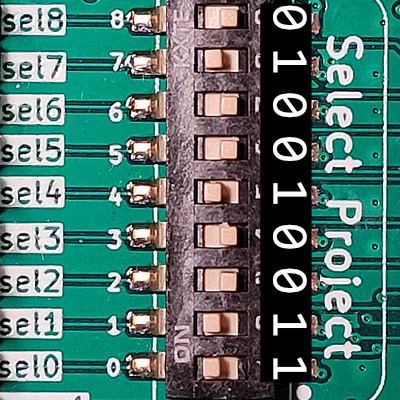
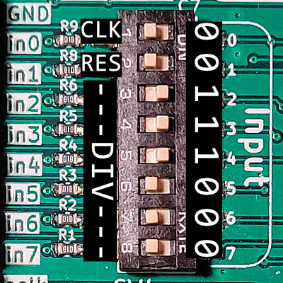
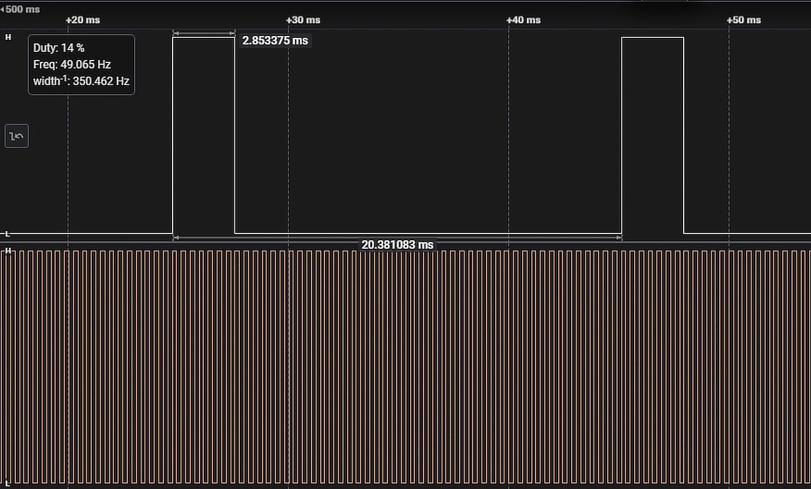

# Bringup of Tiny Tapeout Project 147: PWM Generator

This project converts an input clock to a 50x slower output clock that has a set duty cycle.

## Links

[TT02 overview page](https://tinytapeout.com/runs/tt02/)

[Project 147 on TT02: 4-bit Multiplier](https://tinytapeout.com/runs/tt02/147/)

[GitHub repo containing the GDS of the PWM Generator](https://github.com/cmu-stuco-98154/f22-tt02-jxlu)

## Hardware needed

- Tiny Tapeout 2 Demo Board

no additional hardware needed, however you might consider using an external clock generator capable of 5kHz, as the board can only supply ~2.5kHz.

## Setup

Select the project by setting the DIP switches to ``0b 010 011 010`` (pay attention to the endianness!).

The project specifies a 5kHz clock, however others have shown to work as well. This clock is expected on pin ``in0``, and can be suppplied externally. The board also features a built in oscillator with a clock divider. The divisor is chosen by the input byte and locked in by plugging in the provided bridge into the ``SLOWCLK`` pins at the top left of the board. After that, the inputs can be used in a regular fashion.

I have tested the project running with the clock divisor initated at ``0b 0000 0000`` for 2.5kHz it works perfectly fine. Everything will simply run at half the speed, hence the output clock will be at 50Hz.

## Play!

Now the inputs ``in2`` to ``in7`` can be used to chose a duty cycle between 0% and 50%. As an example, I've set the inputs to ``0b 111 000`` which equals ``0d 14``.

To set that value in an start clocking, you need to press the reset button once. If you ever change the value, press it again to update the circuit.

Taking a look at the output PWM signal at ``out0`` with a logic analyzer we can see indeed a frequenzy of 50Hz and a duty cycle of 14%, meaning the circuit operates as expected!.

You can now choose different duty cycles and observe the results in a logic analyzer/oscilloscope or by the changing brightness of the top bar of the 7-segment display.
